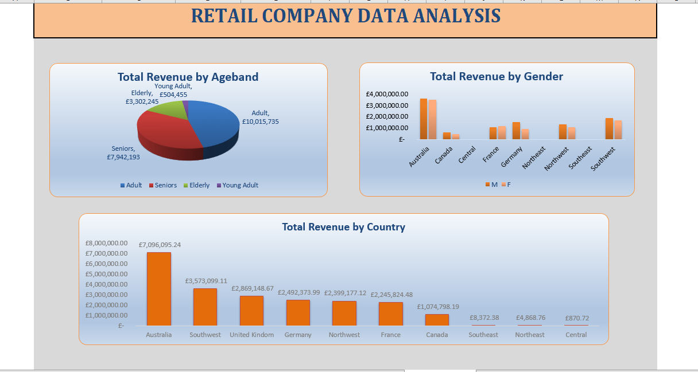

# Retail_Company_Sales_Analysis
This is retail company's sales analysis done using Excel

## Introduction

In this analysis, I examined the sales data of a retail company to uncover key insights that can drive business decisions. Using Excel, I calculated the sum of revenue segmented by gender, country, and age band. I employed IF statements to categorize customers into different age bands and to determine customer value. This analysis provides a clear understanding of revenue distribution across various demographics, helping to identify high-value customer segments and regional performance.

## Problem Statement

The retail company aims to enhance its sales strategy by better understanding its customer demographics and revenue distribution. However, the current sales data lacks clear segmentation and insights into key factors such as gender, country, and age. Without this information, the company struggles to identify high-value customer segments, optimize marketing efforts, and tailor product offerings to meet customer needs.

To address this, the sales data needs to be analyzed using Excel to calculate the sum of revenue by gender, country, and age band. By employing IF statements to categorize customers into age bands and determine customer value, with aim to provide actionable insights that can drive strategic decision-making and improve overall sales performance.

## Data Source
The dataset used for this analysis was given by Dahel Techies and Consultants. It includes detailed transaction information such as customer ID, Name, Customer Gender, Country of Purchase, and Date of birth. This raw data was imported into Excel for analysis. The data was then cleaned and structured to ensure accuracy and consistency. Age bands were calculated using the customers' dates of birth, and revenue figures were aggregated by gender, country, and age band using various Excel functions, including IF statements for categorization.

## Data Cleaning and Transformation

- I identified and removed duplicates to ensure data accuracy.
- I filled in Missing values in critical fields such as gender, country, and date of birth with appropriate defaults or removing the incomplete records.
- I standardized inconsistent data formats (e.g., date formats, text cases)  to ensure uniformity across the dataset.
- I made sure all entries were validated to ensure they fell within reasonable and expected ranges.
- Using the customers' dates of birth, I used the IF statement to classify customers into various age bands (e.g., 13-19 as tenagers, 20-34 as young adult, 35-49 as adult, 50 - 64 as senior and 65 and above as elderly).
- I also used IF statements to categorize customers based on their total revenue contribution like casual buyers, brand seekers and convinced seekers.
- Revenue figures were summed and segmented by gender, country, and age band to provide detailed insights.
- Visualizing Data: Charts and graphs were generated to visually represent the insights, making it easier to interpret trends and patterns in the data.
- Then I began to visualize

## Data Visualization

The visualization was done using Microsoft excel.

## Insight and Recommendation

